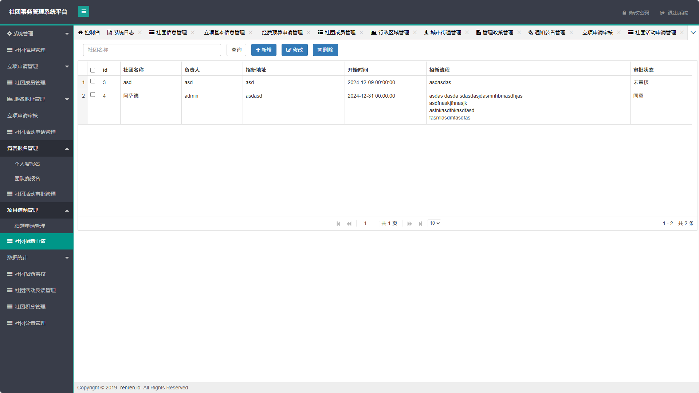

# 社团事务管理系统(文末免费领取☟)
> 
#### 介绍
社团事务管理系统(Java_SpringBoot)
有BUG可留言加微

#### 软件架构
Java + SpringBoot + Mybatis + Mysql

#### 项目功能说明

> + 系统管理：用户管理、部门管理、角色管理、菜单管理、文件上传、系统日志
> + 社团信息管理
> + 立项申请管理：立项基本信息管理、经费预算申请管理
> + 社团成员管理
> + 地名地址管理：行政区域管理、城市街道管理、门牌申请管理、通知公告管理、管理政策管理
> + 立项申请审核
> + 社团活动申请管理
> + 竞赛报名管理：个人赛报名、团队赛报名
> + 社团活动审批管理
> + 项目结题管理：结题申请管理
> + 社团招新申请
> + 数据统计：项目结题统计
> + 社团招新审核
> + 社团活动反馈管理
> + 社团积分管理
> + 社团公告管理

### 部分功能演示

### 环境需求(可免费提供)
- idea/eclipse、jdk-1.8、maven-3.8.6、mysql、node.js等

## 有项目修改、安装调试需求 请联系以下

## 获取资源扫☝☝☝

